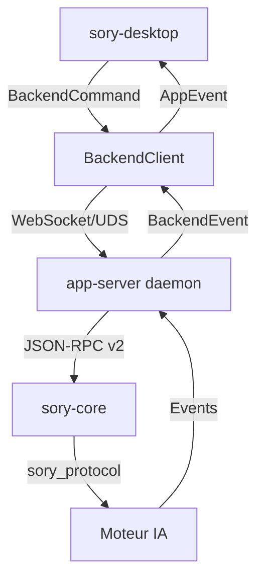

# Build unifié pour cosmic-sory-ia

Ce projet utilise désormais un **workspace Cargo unifié** pour éviter la double compilation des dépendances entre `sory-ia` (moteur) et `sory-desktop` (UI).

## Avantages

- ⏱️ **Temps de build réduit** : 3-4h au lieu de 6-9h
- 💾 **Espace disque économisé** : 15-20 Go au lieu de 30-40 Go
- 🔄 **Cache Cargo partagé** : les crates ne sont téléchargées qu'une fois
- 🔧 **Compilation incrémentale** : possible entre les deux parties

## Structure du workspace

```
soryos/cosmic-epoch/cosmic-sory-ia/
├── Cargo.toml                  # Workspace racine unifié
├── sory-ia/
│   └── sory-rs/               # Workspace Rust du moteur IA (115+ crates)
│       ├── core/              # Cœur du moteur (fork OpenAI Codex)
│       ├── cli/               # Interface CLI
│       ├── tui/               # Interface terminal
│       ├── app-server/        # Daemon pour les clients riches
│       ├── utils/             # Utilitaires partagés
│       └── ... (115 crates)
└── sory-desktop/               # Client graphique COSMIC
    ├── src/                   # Code source
    └── Cargo.toml             # Dépendances (maintenant partagées)
```

## Build

### Méthode recommandée (script unifié)

```bash
# Depuis la racine du projet
./build_unified.sh
```

Ce script :
1. Build tout le workspace en mode release
2. Copie les binaires dans `target/release/`
3. Crée un script de lancement configuré

### Build manuel

```bash
# Depuis la racine
cargo build --release --workspace
```

### Build incrémental (développement)

```bash
# Build uniquement le desktop (utilise le cache du workspace)
cargo build -p sory-desktop

# Build uniquement le CLI
cargo build -p sory-cli
```

## Artefacts générés

Après build, les binaires sont disponibles dans :

- `sory-ia/sory-rs/target/release/sory` → CLI Sory IA
- `sory-desktop/target/release/sory-desktop` → Interface graphique
- `target/release/run_sory.sh` → Script de lancement configuré

## Configuration

Le desktop utilise le binaire CLI comme runtime. Deux méthodes pour le configurer :

### 1. Variable d'environnement (recommandé)

```bash
export SORY_IA_RUNTIME_COMMAND="/chemin/vers/sory"
```

### 2. Fichier de configuration

Le desktop cherche automatiquement le binaire dans :
- `../sory-ia/sory-rs/target/release/sory` (chemin relatif)
- `$SORY_IA_HOME/bin/sory`
- `/usr/local/bin/sory`

## Résolution des problèmes

### Erreur de cache

Si Cargo semble recompiler tout :

```bash
# Nettoyer le cache (conserve les artefacts)
cargo clean -p sory-desktop

# Forcer l'utilisation du cache
cargo build --release --workspace --offline
```

### Problème de dépendances

```bash
# Mettre à jour toutes les dépendances
cargo update --workspace

# Vérifier les dépendances
cargo tree -p sory-desktop
```

## Architecture technique

### Communication entre desktop et runtime



### Partage des dépendances

Les crates suivantes sont partagées via le workspace :

- `sory-app-server-client` : client du protocole app-server
- `sory-app-server-protocol` : définitions du protocole JSON-RPC
- `sory-utils-*` : utilitaires (paths, home dir, etc.)
- `tokio`, `serde`, `anyhow`, etc. : dépendances transitives

## Migration depuis l'ancienne structure

Si vous veniez de l'ancienne structure (workspaces séparés) :

1. Supprimez les anciens `target/` pour forcer l'utilisation du cache unifié :
   ```bash
   rm -rf sory-ia/sory-rs/target sory-desktop/target
   ```

2. Utilisez le nouveau workspace :
   ```bash
   cargo build --release --workspace
   ```

## Notes

- Le workspace utilise `resolver = "2"` pour une meilleure gestion des dépendances
- Les builds en release utilisent Thin LTO (`lto = "thin"`) pour éviter les OOM avec 3.7 Go de RAM sur 115 crates
- Le profil `dev-small` (inherits dev, opt-level=0, debug=none) peut être utilisé pour des tests rapides sans LTO
- `codegen-units = 16` permet au compilateur de paralléliser la génération de code et réduit le pic mémoire
- Le cache Cargo est automatiquement partagé entre tous les membres du workspace
- **Swap thrashing** : deux `rustc` en parallèle (sory-mcp-server + sory-tui) consomment >1 Go de RAM cumulé. Sur 3.7 Go, le système swappe intensivement (4.4 Go swap, jusqu'à 3.9 Go utilisé). En cas de build bloqué/ralenti, limiter à 1 job : `cargo build --release --jobs 1`
