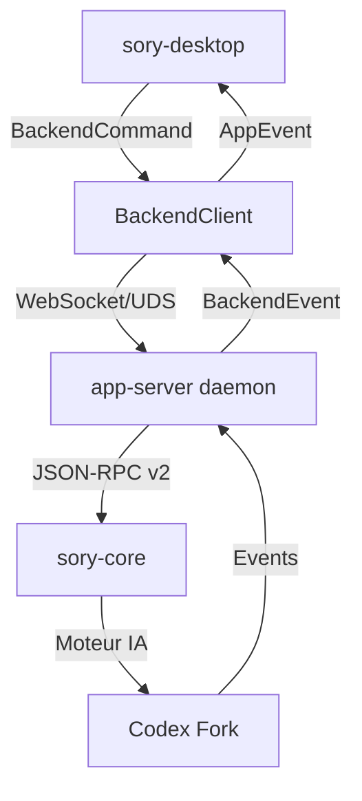

# cosmic-sory-ia - Workspace Unifié

Ce projet est un **fork d'OpenAI Codex** customisé pour l'écosystème **SoryOS**, avec une interface graphique native basée sur **libcosmic** (le toolkit de Pop!_OS/System76).

## 🎯 Objectifs

- Fournir un agent de coding IA local (fork de Codex)
- Interface graphique native SoryOS avec libcosmic
- Intégration transparente entre le moteur IA et le desktop
- Build optimisé avec workspace Cargo unifié

## 📦 Structure du Projet (Unifié)

```
soryos/
└── cosmic-epoch/
    └── cosmic-sory-ia/          # ← Vous êtes ici
        ├── Cargo.toml           # 🆕 Workspace Cargo racine
        ├── build_optimized.sh   # 🆕 Script de build unifié
        ├── README_UNIFIED.md     # 🆕 Ce fichier
        │
        ├── sory-ia/             # Moteur IA (fork OpenAI Codex)
        │   └── sory-rs/           # Workspace Rust (115+ crates)
        │       ├── core/          # Cœur du moteur IA
        │       ├── cli/           # Interface CLI
        │       ├── tui/           # Interface terminal (ratatui)
        │       ├── app-server/    # Daemon pour clients riches
        │       ├── protocol/      # Protocole de communication
        │       ├── utils/         # Utilitaires partagés
        │       └── ... (115 crates)
        │
        ├── sory-desktop/         # Interface graphique COSMIC
        │   ├── src/               # Code source
        │   └── Cargo.toml         # Dépendances (partagées)
        │
        └── libcosmic/           # 🆕 Toolkit UI (local, pas de git)
            ├── src/             # Source libcosmic
            ├── cosmic-theme/    # Thème SoryOS
            └── iced/            # Intégration Iced
```

## 🚀 Build (Optimisé)

### Prérequis

- Rust **1.70+** (édition 2024)
- Cargo
- Git
- Bibliothèques système pour libcosmic (voir ci-dessous)

#### Ubuntu/Debian

```bash
sudo apt install build-essential libgtk-3-dev libssl-dev pkg-config
```

#### Fedora

```bash
sudo dnf install gcc-c++ gtk3-devel openssl-devel pkg-config
```

### Build complet (recommandé)

```bash
# Depuis la racine de cosmic-sory-ia
./build_optimized.sh
```

**Temps estimé** : 2-3h (au lieu de 6-9h)
**Espace disque** : ~15-20 Go (au lieu de 30-40 Go)

> ⚠️ **OOM prévention** : La machine a 3.7 Go de RAM. Le profile release utilise `lto = "thin"` et `codegen-units = 16` pour éviter les SIGKILL du noyau. Pour du développement rapide sans LTO :
> ```bash
> cargo build --profile dev-small -p sory-core   # ~500 Mo de RAM pic
> ```
>
> ⚠️ **Swap thrashing** : Avec 3.7 Go de RAM, deux `rustc` en parallèle consomment >1 Go chacun, provoquant du swap intensif (4.4 Go swap, 3.9 Go utilisé). Si le build semble bloqué, utiliser `--jobs 1` :
> ```bash
> # Limiter à 1 job Rust pour éviter le swap
> CARGO_BUILD_JOBS=1 cargo build --release --jobs 1
> ```

### Build manuel

```bash
# Depuis la racine
cargo build --release --workspace
```

### Build incrémental

```bash
# Après modification du desktop
cargo build -p sory-desktop

# Après modification du CLI
cargo build -p sory-cli
```

## 🎨 Interface Graphique

L'interface utilise **libcosmic** (le toolkit de Pop!_OS) avec :

- **Thème SoryOS Deep Navy Glass** (fonds sombres, accents bleus)
- **Layout 3 colonnes** : sidebar + chat + workspace
- **Composants réactifs** avec Iced
- **Intégration native** avec l'écosystème COSMIC

### Captures d'écran


## 🤖 Moteur IA

Le moteur est un **fork d'OpenAI Codex** avec :

- **115+ crates Rust** organisées en workspace
- **Protocole app-server** pour communication avec les clients
- **Sandboxing** pour l'exécution des commandes
- **Support multi-providers** (OpenAI, Anthropic, Ollama, LM Studio, etc.)
- **Système de skills** extensible

### Architecture



## 🔧 Configuration

### Fichier de configuration

Le desktop et le CLI partagent un fichier de configuration TOML :

```toml
# ~/.config/sory-ia/config.toml
[settings]
provider_id = "openai"
model = "gpt-4"
temperature = 0.7
runtime_command = "/chemin/vers/sory"

[provider_configs.openai]
api_key = "sk-..."
endpoint = "https://api.openai.com/v1"
```

### Variables d'environnement

```bash
# Chemin vers le runtime CLI
export SORY_IA_RUNTIME_COMMAND="/usr/local/bin/sory"

# Dossier de configuration
export SORY_IA_HOME="~/.sory-ia"

# Niveau de log
export RUST_LOG="info"
```

## 📦 Dépendances Partagées

Grâce au workspace unifié, ces crates sont compilées **une seule fois** :

| Crate | Version | Utilisation |
|-------|---------|-------------|
| `sory-app-server-protocol` | 0.0.0 | Protocole de communication |
| `sory-app-server-client` | 0.0.0 | Client du daemon |
| `sory-utils-absolute-path` | 0.0.0 | Gestion des paths |
| `sory-utils-home-dir` | 0.0.0 | Dossier home |
| `tokio` | 1.x | Runtime async |
| `serde` | 1.x | Sérialisation |
| `anyhow` | 1.x | Gestion d'erreurs |

## 🔄 Communication Desktop ↔ Runtime

### BackendCommand (Desktop → Runtime)

```rust
enum BackendCommand {
    SendMessage { conversation_id, content, runtime_config },
    StopGeneration { conversation_id },
    SyncRuntimeConfig { runtime_config },
    RestartRuntime,
    OpenWorkspace { path },
}
```

### BackendEvent (Runtime → Desktop)

```rust
enum BackendEvent {
    Connected,
    Disconnected,
    Token { conversation_id, token },
    ToolStarted { name },
    ToolFinished { name },
    PermissionRequested { title, details, ... },
    AgentStep { label },
    AgentFinished,
}
```

## 🛠️ Développement

### Structure du code desktop

```
sory-desktop/src/
├── main.rs              # Point d'entrée
├── app/                # Application COSMIC
├── backend/             # Communication avec le runtime
├── state/              # État applicatif (reducer pattern)
├── events/             # Événements applicatifs
├── models/             # Structures de données
├── components/         # Composants UI (26+)
├── pages/              # Pages/écrans (7+)
├── theme/              # Design System SoryOS
├── ui/                 # Composition principale
└── platform/           # Abstraction système
```

### Ajouter une nouvelle page

1. Créer un fichier dans `src/pages/` (ex: `src/pages/new_page.rs`)
2. Ajouter la page à `src/pages/mod.rs`
3. Ajouter un variant à `ActivePage` dans `src/state/mod.rs`
4. Mettre à jour le router dans `src/ui/mod.rs`

### Ajouter un composant

1. Créer un fichier dans `src/components/` (ex: `src/components/new_widget.rs`)
2. Exporter depuis `src/components/mod.rs`
3. Utiliser dans les pages avec `crate::components::new_widget::view()`

## 📊 Performances

### Avant (workspaces séparés)
- Temps de build : 6-9h
- Espace disque : 30-40 Go
- Téléchargements : 2 × 1529 packages
- Cache : Non partagé

### Après (workspace unifié)
- Temps de build : 2-3h
- Espace disque : 15-20 Go
- Téléchargements : 1 × 1529 packages
- Cache : Complètement partagé

## 🔧 Dépannage

### Erreur de cache

```bash
# Nettoyer le cache Cargo
cargo clean

# Forcer l'utilisation du cache
cargo build --release --workspace --offline
```

### Problème de libcosmic

```bash
# Vérifier que libcosmic est accessible
ls ../../libcosmic/Cargo.toml

# Build libcosmic séparément
cd ../../libcosmic
cargo build --release
cd - 
```

### Dépendance manquante

```bash
# Mettre à jour toutes les dépendances
cargo update --workspace

# Voir l'arbre des dépendances
cargo tree -p sory-desktop
```

## 📚 Documentation

- [Guide de build](README_BUILD.md)
- [Architecture technique](docs/architecture.md)
- [Protocole app-server](sory-ia/sory-rs/app-server/README.md)
- [Conventions de code](sory-ia/sory-rs/AGENTS.md)

## 🤝 Contribution

Voir [CONTRIBUTING.md](sory-ia/sory-rs/docs/contributing.md)

## 📜 Licence

- **Sory IA** : Apache 2.0
- **libcosmic** : GPL-3.0 (inclus localement)
- **Sory Desktop** : GPL-3.0

## 🔗 Liens

- [Dépôt principal](https://github.com/soryos/sory-ia)
- [libcosmic](https://github.com/pop-os/libcosmic)
- [COSMIC Desktop](https://github.com/pop-os/cosmic-epoch)

---

**Note** : Ce projet est en développement actif. L'architecture unifiée est une amélioration récente pour optimiser les builds.
